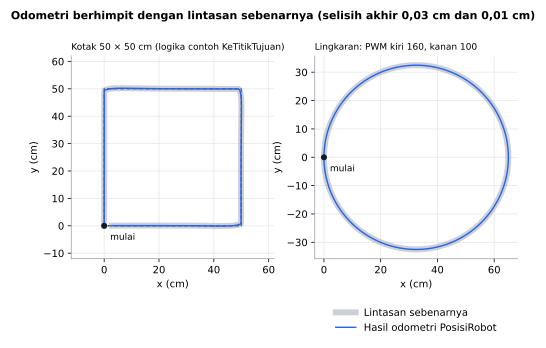
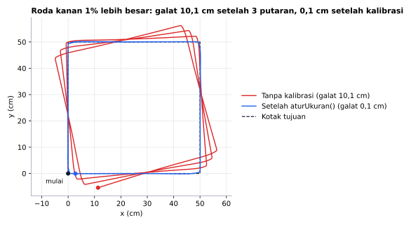

# PosisiRobot

[English](README.en.md)

Library Arduino berbahasa Indonesia untuk **odometri robot dua roda**: posisi x, y (cm) dan arah robot dihitung dari encoder roda. Non-blocking, cukup kirim hitungan encoder ke `perbarui()`.

```cpp
posisi.perbarui(pulsaKiri, pulsaKanan);
posisi.x();  posisi.y();  posisi.arah();
posisi.selisihArahKe(50, 100);   // belok berapa derajat ke titik (50, 100)?
```

## Fitur

- **Posisi x, y dalam cm** dan **arah 0–360 derajat**, naik searah jarum jam (sama dengan [ArahMPU6050](https://github.com/nothinx/ArahMPU6050)).
- **Ke titik tujuan**: `jarakKe()`, `arahKe()`, dan `selisihArahKe()` (positif = belok kanan).
- **Hitungan encoder kumulatif**, bukan selisih: tidak ada pulsa yang hilang walau `perbarui()` terlambat dipanggil.
- **Aman saat counter `long` meluap.**
- **Integrasi busur eksak**: gerak melengkung dihitung sebagai busur lingkaran, bukan garis lurus, jadi tidak ada galat tambahan walau `perbarui()` jarang dipanggil.
- **Koreksi arah dari IMU** lewat `aturArah()`.
- **Kalibrasi roda**: diameter roda kiri & kanan boleh berbeda (`aturUkuran()`), plus contoh cara mengukurnya.
- Hanya 41 byte RAM. Tanpa `delay()`, tanpa interrupt di dalam library, jadi bebas dipakai dengan library encoder apa pun.

## Board yang didukung

| Board | Teruji compile |
|---|---|
| Arduino Uno / Nano | ✅ |
| Arduino Mega | ✅ |
| ESP32 DevKit | ✅ |
| ESP32-C3 / S3 | ✅ |
| STM32 Blackpill F411 | ✅ |
| STM32 Bluepill F103 | ✅ |

Library ini murni perhitungan (`float`, `sin`, `cos`), jadi seharusnya bekerja di board Arduino lain juga.

## Instalasi

**Library Manager:** Arduino IDE → *Sketch → Include Library → Manage Libraries…* → cari **PosisiRobot** → *Install*.

**Manual:** unduh ZIP dari GitHub → *Sketch → Include Library → Add .ZIP Library…*

## Koordinat

Seperti peta, dengan robot di titik (0, 0) saat mulai atau `reset()`:

| Arah | Sumbu | Artinya |
|---|---|---|
| 0 | +Y | depan robot saat mulai |
| 90 | +X | kanan robot saat mulai |
| 180 | −Y | belakang |
| 270 | −X | kiri |

Semua panjang dalam **cm**.

## Contoh cepat

```cpp
#include <PosisiRobot.h>

// Diameter roda 6,5 cm, jarak antar roda 15 cm, 374 pulsa per putaran roda.
PosisiRobot posisi(6.5, 15.0, 374);

volatile long pulsaKiri = 0, pulsaKanan = 0; // diisi oleh interrupt encoder

void loop() {
  noInterrupts();                 // salin counter utuh
  long kiri = pulsaKiri, kanan = pulsaKanan;
  interrupts();
  posisi.perbarui(kiri, kanan);

  Serial.print(posisi.x());
  Serial.print(", ");
  Serial.println(posisi.y());
}
```

Kirim **hitungan total** encoder (yang terus naik/turun), bukan selisih sejak panggilan terakhir. Hitungan harus **naik saat roda maju**. Jika roda kanan terbalik (biasanya karena motornya dipasang berhadapan), tukar kabel A & B encoder itu.

Panggil `perbarui()` sesering mungkin (10–50 kali per detik sudah cukup). Panggilan pertama hanya mencatat hitungan awal.

## Hasil simulasi



Robot dua roda disimulasikan di PC (roda 6,5 cm, jarak roda 15 cm, encoder 374 pulsa per putaran, `perbarui()` tiap 20 ms). PosisiRobot hanya menerima hitungan encoder. Kiri: robot dikemudikan ke empat titik kotak dengan logika contoh `KeTitikTujuan` (`jarakKe()` dan `selisihArahKe()`). Kanan: PWM tetap, robot melingkar satu putaran. Selisih posisi odometri dan posisi sebenarnya di akhir: 0,03 cm dan 0,01 cm.



Roda kanan sebenarnya 1% lebih besar, robot menjalankan kotak yang sama tiga kali. Tanpa kalibrasi, odometri mengira robot tetap di kotak, padahal lintasan sebenarnya (merah) berputar pelan dan di akhir posisinya meleset 10,1 cm dari perkiraan. Dengan `aturUkuran()` berisi diameter yang benar (hasil `KalibrasiRoda`), selisihnya 0,1 cm.

Grafik dibuat dari simulasi di PC yang menjalankan kode library ini (`extras/simulasi`):

```sh
cd extras/simulasi
python gambar.py   # butuh g++ dan matplotlib
```

## Referensi fungsi

### Dasar

| Fungsi | Keterangan |
|---|---|
| `PosisiRobot(float diameterRoda, float jarakRoda, float pulsaPerPutaran)` | Ukuran dalam cm. `jarakRoda` diukur dari tengah tapak roda kiri ke tengah tapak roda kanan. `pulsaPerPutaran`: hitungan encoder per satu putaran roda (setelah gearbox). |
| `void perbarui(long pulsaKiri, long pulsaKanan)` | Kirim hitungan encoder kumulatif. |
| `void reset()` | Posisi (0, 0), arah 0, jarak tempuh 0. Counter encoder tidak perlu di-nol-kan. |

### Posisi

| Fungsi | Keterangan |
|---|---|
| `float x()` | cm, positif = kanan posisi awal. |
| `float y()` | cm, positif = depan posisi awal. |
| `float arah()` | 0–360 derajat, naik searah jarum jam. |
| `float jarakTempuh()` | Total jarak yang ditempuh titik tengah robot (cm), maju maupun mundur. |

### Ke titik tujuan

| Fungsi | Keterangan |
|---|---|
| `float jarakKe(float x, float y)` | Jarak lurus ke titik (cm). |
| `float arahKe(float x, float y)` | Arah ke titik, 0–360. |
| `float selisihArahKe(float x, float y)` | Selisih terpendek dari arah robot ke arah titik, −180..180. Positif = belok kanan. |

### Koreksi & kalibrasi

| Fungsi | Keterangan |
|---|---|
| `void aturArah(float derajat)` | Timpa arah, misalnya dengan arah dari IMU. |
| `void aturUkuran(float diameterKiri, float diameterKanan, float jarakRoda)` | Hasil kalibrasi (contoh `KalibrasiRoda`). |

## Menggabungkan dengan ArahMPU6050

Odometri menghitung arah dari selisih putaran roda, sehingga arah paling cepat meleset saat roda selip (belok tajam, lantai licin). Gyro tidak terpengaruh selip. Gabungkan keduanya: posisi dari encoder, arah dari gyro.

```cpp
#include <ArahMPU6050.h>
#include <PosisiRobot.h>

ArahMPU6050 imu;
PosisiRobot posisi(6.5, 15.0, 374);

void loop() {
  imu.perbarui();
  posisi.perbarui(kiri, kanan);
  posisi.aturArah(imu.arah()); // arah dari gyro menggantikan arah dari roda
}
```

Konvensi arah kedua library sama (0–360, naik searah jarum jam), jadi tidak perlu konversi. Contoh ini tidak disertakan di `examples/` karena butuh library ArahMPU6050 terpasang.

## Contoh yang tersedia

*File → Examples → PosisiRobot*

| Contoh | Isi |
|---|---|
| `OdometriDasar` | Dua encoder dengan interrupt, posisi dicetak di Serial Monitor. |
| `KeTitikTujuan` | Robot bergerak ke beberapa titik berurutan (kotak 50 × 50 cm). |
| `KalibrasiRoda` | Mengukur diameter roda dan jarak antar roda yang sebenarnya. |

## Ketelitian

Odometri selalu menumpuk galat seiring jarak. Penyebab terbesar biasanya bukan rumus, tapi:

1. **Ukuran roda meleset.** Selisih diameter 1% antara roda kiri dan kanan membuat robot dengan jarak roda 15 cm "merasa" berbelok hampir 4 derajat setiap 1 meter. Jalankan `KalibrasiRoda`.
2. **Roda selip** saat akselerasi atau belok tajam. Percepat motor perlahan, atau ambil arah dari gyro (lihat di atas).
3. **Resolusi encoder rendah.** Encoder dengan pulsa lebih banyak per putaran memberi posisi lebih halus.

## Dibanding library lain

Dicek dari source code library odometri yang ada di Library Manager:

| | PosisiRobot | DeadReckoning-library | Aerobotix_Arduino_nav |
|---|---|---|---|
| Non-blocking | ✅ | ✅ | ❌ gerak memakai `while` + `delay(10)` |
| Menyimpan posisi x, y | ✅ | ✅ | ❌ `go()` memakai jarak tempuh total × cos/sin arah sekarang |
| Hitungan encoder dua arah | ✅ `long` bertanda | ❌ `unsigned long`, arah diatur terpisah | ✅ |
| Contoh bawaan bisa dicompile | ✅ | ❌ konstruktor dipanggil dengan 5 argumen, butuh 6 | ✅ |
| Fungsi ke titik tujuan | ✅ | ❌ | ✅ (blocking) |
| Satuan arah | derajat, searah jarum jam | radian, tidak dibungkus | radian |

Catatan lain dari source: DeadReckoning-library membaca counter `volatile unsigned long` lewat pointer tanpa mematikan interrupt (di AVR nilai 4 byte bisa terbaca setengah diperbarui), dan Aerobotix_Arduino_nav mengubah counter encoder di interrupt tanpa `volatile`. Contoh DeadReckoning-library dicek dari branch `master`.

## Pengujian

Gerak lurus, putar di tempat 360°, busur seperempat lingkaran dalam satu langkah, lingkaran penuh, kotak kembali ke titik awal, konvensi tanda, luapan counter, dan fungsi navigasi diuji otomatis di PC (`extras/test`) setiap ada perubahan:

```sh
cd extras/test
g++ -std=c++11 -I. -I../../src uji.cpp ../../src/PosisiRobot.cpp -o uji && ./uji
```

## Status

Versi 1.0.0 sudah lolos uji logika otomatis dan compile di 7 board, tapi **belum diuji di robot sungguhan**. Jika menemukan masalah, silakan buka *issue* di GitHub.

## Lisensi

MIT © 2026 Amadeo Wisesa. Lihat [LICENSE](LICENSE).
